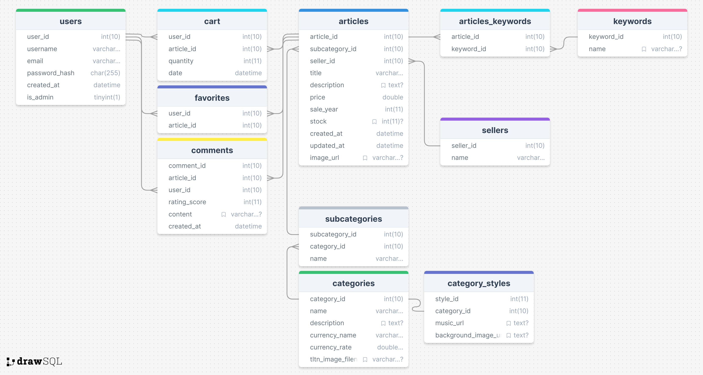

# SAE 203 - Voyage dans le Temps

## Description
"Voyage dans le Temps" est un projet d'e-commerce scolaire réalisé dans le cadre de la troisième Situation d'Apprentissage et d'Évaluation (SAE) du deuxième semestre du BUT MMI à Haguenau. Le site propose une expérience immersive permettant aux utilisateurs de voyager à travers différentes époques historiques et d'explorer des produits typiques de chaque période. Ce projet utilise PHP, Twig, HTML, CSS, JavaScript et SQL pour créer un site web interactif et responsive.

## Objectifs
L'objectif principal de ce projet est d'être évalué sur les compétences acquises durant l'année, notamment :
- Développer pour le web et les médias numériques
- Produire du code fonctionnel, sobre et réutilisable
- Modéliser les données et les traitements d'une application web
- Intégrer des pages web fluides et accessibles

## Public Cible
Le projet est principalement destiné à être évalué par les professeurs. Il sera également visible par les camarades de promotion et potentiellement partagé publiquement pour attirer l'attention des recruteurs.

## Technologies Utilisées
- **Frontend** : HTML, CSS, JavaScript (Ajax)
- **Backend** : PHP, Twig
- **Base de Données** : MySQL (InnoDB)

## Fonctionnalités Principales
- Navigation temporelle immersive à travers différentes époques
- Affichage des produits sous forme de vignettes ou de listes
- Possibilité de consulter et d'acheter des articles fictifs
- Système de notation et de commentaires des articles
- Connexion et inscription des utilisateurs
- Ajout et suppression de mots-clés

## Prérequis
- Serveur web avec support PHP (ex : XAMPP, WAMP)
- Base de données MySQL
- Installation de Twig via Composer

## Installation

1. **Cloner le dépôt** :
   ```bash
   git clone https://github.com/Noferu/sae203.git
   cd sae203
   ```

2. **Installer les dépendances avec Composer** :
   ```bash
   composer install
   ```

3. **Configurer la base de données** :
   - Créez une base de données MySQL.
   - Importez le fichier `bdd_sae203.sql` situé dans le dossier `database`.
   - Modifiez les paramètres de connexion à la base de données dans le fichier `config/config.php`.

4. **Lancer le serveur local** (ex : avec XAMPP) et accéder au projet via `http://localhost/sae203/index.php`.

## Utilisation
Accédez à la racine du projet via votre navigateur : `http://localhost/sae203/index.php`.

## Contribution
Ce projet est principalement un projet scolaire. Toutefois, les contributions sont les bienvenues :
- Donnez votre avis et conseils.
- Signalez les problèmes ou proposez des améliorations via des pull requests.

## Arborescence des fichiers
```
sae203/
├── assets/
│   ├── audio/
│   ├── css/
│   ├── images/
│   │   ├── articles/
│   │   ├── icons/
│   │   └── timeline_images/
│   └── js/
├── config/
│   └── config.php
├── database/
│   ├── bdd_sae203.sql
│   └── MCD_BDD.png
├── include/
│   ├── connexion.php
│   ├── connexion_controller.php
│   ├── data_access.php
│   ├── fetch_articles.php
│   ├── twig.php
│   └── UserService.php
├── pages/
│   ├── checkout.php
│   ├── not_found_page.html
│   ├── product.php
│   └── user_connexion.php
├── templates/
│   ├── includes/
│   └── product/
├── vendor/
│   └── autoload.php
├── wireframes/
│   └── *.png
├── .htaccess
├── composer.json
├── composer.lock
└── index.php
```

## Modèle Conceptuel de Données (MCD)
Voici le Modèle Conceptuel de Données utilisé pour ce projet :



## Consignes et Objectifs Pédagogiques
Ce projet vise à valider plusieurs compétences clés :
- Combiner les ressources liées au développement et à la gestion des bases de données.
- Produire des pages fluides, valides et accessibles en respectant les normes du W3C.
- Mettre en ligne une application Web en utilisant une solution d’hébergement standard.

## Portfolio
Découvrez mes autres projets sur mon [portfolio](https://www.ida.etu.mmi-unistra.fr/).

## Licence
Ce projet est sous licence MIT. Voir le fichier [LICENSE](./LICENSE) pour plus de détails.
