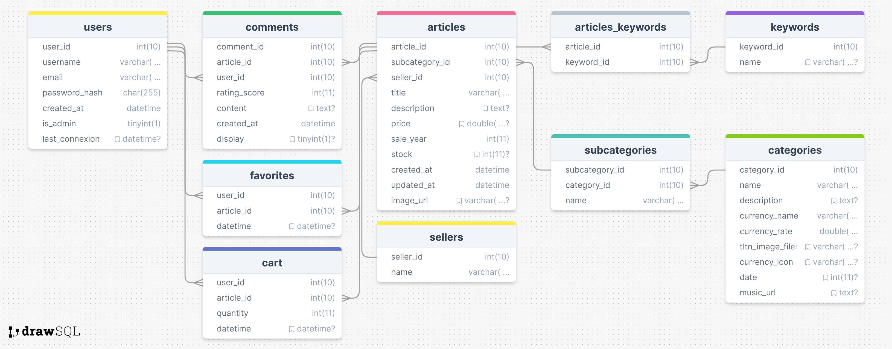

# SAE 203 - Era Explorer

## Description

"Era Explorer" est un projet d'e-commerce scolaire réalisé dans le cadre de la troisième Situation d'Apprentissage et d'Évaluation (SAE) du deuxième semestre du BUT MMI à Haguenau. Le site propose une expérience immersive permettant aux utilisateurs de voyager à travers différentes époques historiques et d'explorer des produits typiques de chaque période. Ce projet utilise PHP, Twig, HTML, CSS, JavaScript et SQL pour créer un site web interactif et responsive.

## Objectifs

L'objectif principal de ce projet est d'être évalué sur les compétences acquises durant l'année, notamment :

- Développer pour le web et les médias numériques
- Produire du code fonctionnel, sobre et réutilisable
- Modéliser les données et les traitements d'une application web
- Intégrer des pages web fluides et accessibles

## Public Cible

Le projet est principalement destiné à être évalué par les professeurs. Il sera également visible par les camarades de promotion et potentiellement partagé publiquement pour attirer l'attention des recruteurs.

## Technologies Utilisées

- **Frontend** : HTML, CSS, JavaScript (Ajax)
- **Backend** : PHP, Twig
- **Base de Données** : MySQL (InnoDB)

## Fonctionnalités Principales

- Navigation temporelle immersive à travers différentes époques (néolithique, antiquité, moyen âge, renaissance, époque moderne, futur, féodal, islamique, western)
- Affichage des produits sous forme de vignettes ou de listes
- Possibilité de consulter et d'acheter des articles fictifs
- Système de notation et de commentaires des articles
- Connexion et inscription des utilisateurs
- Ajout de mots-clés
- Suppression de ses propres commentaires
- Affichage détaillé des produits
- Musiques d'ambiance selon les époques
- Affichage des articles les mieux notés sur la page d'accueil
- Filtres sur la vue en liste
- Ajout d'articles au panier et/ou aux favoris
- Interaction avec le panier et les favoris

## Prérequis

- Serveur web avec support PHP (ex : XAMPP, WAMP)
- Base de données MySQL
- Installation de Twig via Composer

## Installation

1. **Cloner le dépôt** :

   ```bash
   git clone https://github.com/Noferu/sae203.git
   cd sae203
   ```

2. **Installer les dépendances avec Composer** :

   ```bash
   composer install
   ```

3. **Configurer la base de données** :

   - Créez une base de données MySQL.
   - Importez le fichier `bdd_sae203.sql` situé dans le dossier `database`.
   - Modifiez les paramètres de connexion à la base de données dans le fichier `config/config.php`.

4. **Lancer le serveur local** (ex : avec XAMPP) et accéder au projet via `http://localhost/sae203/index.php`.

## Utilisation

Accédez à la racine du projet via votre navigateur : `http://localhost/sae203/index.php`.

## Contribution

Ce projet est principalement un projet scolaire. Toutefois, les contributions sont les bienvenues :

- Donnez votre avis et conseils.
- Signalez les problèmes ou proposez des améliorations via des pull requests.

## Arborescence des fichiers

```
sae203/
├── .htaccess
├── composer.json
├── composer.lock
├── index.php
├── LICENSE
├── README.md
├── assets/
│ ├── audio/
│ │ └── sfx/
│ │ ├── boing.mp3
│ │ ├── click.mp3
│ │ ├── clicked.mp3
│ │ ├── pow.mp3
│ │ ├── running.mp3
│ │ ├── water_rush.mp3
│ │ ├── whoosh1.mp3
│ │ ├── whoosh2.mp3
│ │ ├── whoosh3.mp3
│ │ ├── whoosh4.mp3
│ │ ├── whoosh5.mp3
│ │ ├── whoosh6.mp3
│ │ └── whoosh7.mp3
│ ├── css/
│ │ ├── command.css
│ │ ├── favcart.css
│ │ ├── home.css
│ │ ├── product_detail.css
│ │ ├── product_grid.css
│ │ ├── product_list.css
│ │ ├── product_search.css
│ │ ├── reset.css
│ │ ├── style.css
│ │ └── user_connexion.css
│ ├── images/
│ │ ├── articles/
│ │ │ ├── antiquite/
│ │ │ │ ├── amphore-en-ceramique.webp
│ │ │ │ ├── collier-en-perles-de-verre.webp
│ │ │ │ ├── couronne-de-laurier-en-metal-dore.webp
│ │ │ │ └── fresque-murale-portable.webp
│ │ ├── banner/
│ │ │ ├── panoramic_sunset_landscape.webp
│ │ │ └── panoramic_sunset_landscape_blurred.webp
│ │ ├── currency_icons/
│ │ │ ├── coquillage.webp
│ │ │ ├── credit.webp
│ │ │ ├── denier.webp
│ │ │ ├── dirham.webp
│ │ │ ├── dirham1.webp
│ │ │ ├── dirham2.webp
│ │ │ ├── dollar.webp
│ │ │ ├── ecu.webp
│ │ │ ├── florin.webp
│ │ │ ├── livre.webp
│ │ │ └── mon.webp
│ │ ├── icons/
│ │ │ └── wave.ico
│ │ └── timeline_images/
│ │ ├── thumbnail-antiquite.webp
│ │ ├── thumbnail-futur.webp
│ │ ├── thumbnail-hoken-seido.webp
│ │ ├── thumbnail-islamique.webp
│ │ ├── thumbnail-moderne.webp
│ │ ├── thumbnail-moyenage.webp
│ │ ├── thumbnail-neolithique.webp
│ │ ├── thumbnail-renaissance.webp
│ │ └── thumbnail-western.webp
│ ├── js/
│ ├── articleFilterManager.js
│ ├── articleLens.js
│ ├── articleListAnimation.js
│ ├── backButton.js
│ ├── cardHoverEffect.js
│ ├── commentRatingManager.js
│ ├── dynamicFaviconAnimator.js
│ ├── favcartManager.js
│ ├── homeEffects.js
│ ├── interactiveTimeline.js
│ ├── keywordAdder.js
│ ├── loginFormHandler.js
│ ├── miscellaneousEffects.js
│ └── soundsEffectManager.js
├── config/
│ └── config.php
├── database/
│ ├── bdd_sae203.sql
│ └── MCD_BDD.png
├── include/
│ ├── add_keyword.php
│ ├── comment_controller.php
│ ├── connexion.php
│ ├── connexion_controller.php
│ ├── data_access.php
│ ├── favcart_controller.php
│ ├── fetch_articles.php
│ ├── twig.php
│ └── UserService.php
├── pages/
│ ├── checkout.php
│ ├── error.php
│ ├── product.php
│ └── user_connexion.php
├── templates/
│ ├── checkout.twig
│ ├── error.twig
│ ├── home.twig
│ ├── user_connexion.twig
│ ├── includes/
│ │ ├── base.twig
│ │ ├── footer.twig
│ │ └── header.twig
│ └── product/
│ ├── product_detail.twig
│ ├── product_grid.twig
│ ├── product_list.twig
│ └── product_search.twig
├── wireframes/
│ ├── article_page.png
│ ├── cart_confirmation_page.png
│ ├── checkout_page.png
│ ├── favorites_page.png
│ ├── grid_page.png
│ ├── home_page.png
│ ├── list_page.png
│ ├── login_page.png
│ └── maquettes.pdf
```

## Modèle Conceptuel de Données (MCD)

Voici le Modèle Conceptuel de Données utilisé pour ce projet :



## Consignes et Objectifs Pédagogiques

Ce projet vise à valider plusieurs compétences clés :

- Combiner les ressources liées au développement et à la gestion des bases de données.
- Produire des pages fluides, valides et accessibles en respectant les normes du W3C.
- Mettre en ligne une application Web en utilisant une solution d’hébergement standard.

## Détails Techniques et Réflexions Personnelles

### Conformité aux Standards du Web et Accessibilité

Pour garantir la qualité de l'intégration, j'ai suivi les standards HTML5 et CSS3 et utilisé JavaScript pour les fonctionnalités interactives. J'ai vérifié la conformité de mon code avec le W3C Validator et Site24x7. J'ai intégré des textes alternatifs pour les images et appliqué les recommandations d'accessibilité d'AcceDeWeb pour assurer que mon site est accessible à tous les utilisateurs, y compris ceux ayant des handicaps.

### Modélisation de la Base de Données

Ma base de données, nommée bdd_sae203, supporte le site e-commerce avec des tables principales comme articles, categories, subcategories, sellers, users, etc. Les relations entre les tables sont établies avec des clés étrangères pour une meilleure organisation et gestion efficace des données.

Exemple de création de la table `articles` :
```sql
CREATE TABLE `articles` (
  `article_id` INT(10) UNSIGNED NOT NULL,
  `subcategory_id` INT(10) UNSIGNED NOT NULL,
  `seller_id` INT(10) UNSIGNED NOT NULL,
  `title` VARCHAR(255) NOT NULL,
  `description` TEXT DEFAULT NULL,
  `price` DOUBLE(8,2) DEFAULT NULL,
  `sale_year` INT(11) NOT NULL,
  `stock` INT(11) DEFAULT NULL,
  `created_at` DATETIME NOT NULL,
  `updated_at` DATETIME NOT NULL,
  `image_url` VARCHAR(255) DEFAULT NULL
);

ALTER TABLE `articles`
  ADD PRIMARY KEY (`article_id`);

ALTER TABLE `articles`
  ADD INDEX (`subcategory_id`),
  ADD INDEX (`seller_id`);
```

### Qualité et Réutilisabilité du Code

Produire du code fonctionnel, sobre et réutilisable signifie écrire du code correct, efficace, et facile à comprendre, maintenir et étendre. J'ai utilisé des classes modulaires comme UserService et des fonctions personnalisées pour les requêtes SQL. J'ai relu mon code, testé les modifications, et utilisé des outils de validation pour assurer la qualité.

Exemple de fonction pour exécuter des requêtes SQL :
```php
function select_data(PDO $pdo, $sql, array $params = [], $fetchAll = true) {
    $query = $pdo->prepare($sql);
    foreach ($params as $key => $value) {
        $query->bindValue($key, $value);
    }
    $query->execute();
    return $fetchAll ? $query->fetchAll(PDO::FETCH_ASSOC) : $query->fetch(PDO::FETCH_ASSOC);
}
```

### Autonomie et Environnement de Développement

J'ai utilisé Visual Studio Code avec des extensions comme Prettier, Error Lens, et des extensions spécifiques à PHP et Twig. J'ai géré les versions avec GitHub et documenté le projet avec un fichier README. J'ai développé et testé localement sur XAMPP avant de mettre en ligne sur le serveur de l'IUT et Plesk.

### Fluidité et Sémantique des Pages Web

J'ai utilisé HTML5, CSS3, et JavaScript pour produire des pages fluides avec un balisage sémantique. Twig a été utilisé pour le rendu côté serveur et AJAX pour le chargement dynamique des données, améliorant l'expérience utilisateur.

### Sécurité et Hébergement

Pour la sécurité, j'ai utilisé HTTPS, haché les mots de passe, et nettoyé les entrées utilisateur pour éviter les injections SQL. J'ai configuré des fichiers .htaccess pour restreindre l'accès direct et mis en place des restrictions sur les noms d'utilisateur pour maintenir un environnement respectueux.

### Recommandations et Apprentissage

Je recommande de bien planifier la base de données dès le début et de documenter méthodiquement. Je suis fier de la frise chronologique interactive et des filtres dynamiques avec AJAX, ainsi que de la gestion de la connexion avec UserService. J'ai documenté le projet avec des commentaires détaillés et utilisé GitHub pour le contrôle de version pour suivre les bugs et les améliorations.

## Portfolio

Découvrez mes autres projets sur mon [portfolio](https://www.ida.etu.mmi-unistra.fr/).

## Licence

Ce projet est sous licence MIT. Voir le fichier [LICENSE](LICENSE) pour plus de détails.